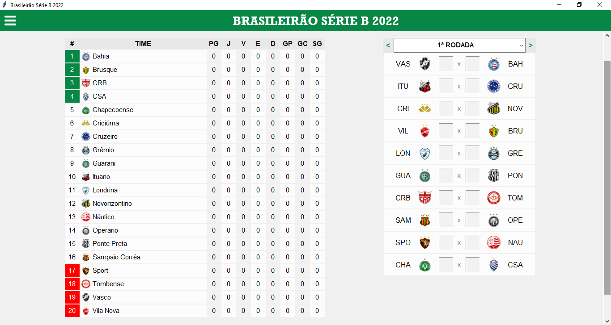

# Pyleague



## 📋 Descrição

Gerenciador de campeonatos de futebol

## ⚙ Funcionalidades

- Criar liga
- Atualizar placares
- Editar liga
- Editar times

## 🛠 Tecnologias utilizadas

- Python
- Tkinter
- Sqlite3

## ▶ Rodando o projeto

- Baixe o projeto:
```git
git clone https://github.com/lucasgabriel07/pyleague.git
```

- Entre no diretório do projeto:
```bash
cd ./pyleague
```

- Instale os requisitos:
```bash
pip install -r requirements.txt
```

- Rode o projeto:
```bash
python main.py
```

##
